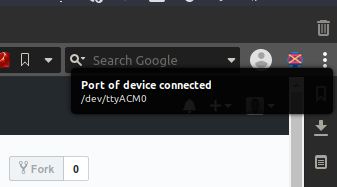

## Port Notifier

Forgive the name, I know it's bad.

Essentially tells you, by means of a system notification, the port details for the serial device that was just connected to your computer. 
I was required to work a lot with software that connected to specific ports of some serial devices and noticed I was visiting Device Manager to get the port numbers of the devices (COM3, etc.) a little too much, so I figured I'd write a simple script to show me the port number immediately.

### Requirements
- Python 3.5+
- Pyserial `pip install pyserial`
- Plyer.   `pip install plyer`
- A Windows or Linux system. Doesn't work on a Mac [yet].

### Usage
Simply run the script, `notify_ports.pyw`. A `.pyw` file extension is used so as not to show any terminal. It's optional really. You can change it to the standard `.py` extension.

It's advisable to set the niceness to 19 in order to minimize memory and CPU footprint (even though it takes little already)
Ubuntu: `nice -n 19 /path/to/python3/with/plyer/installed /path/to/notify_ports.pyw`

### Screenshot
        
